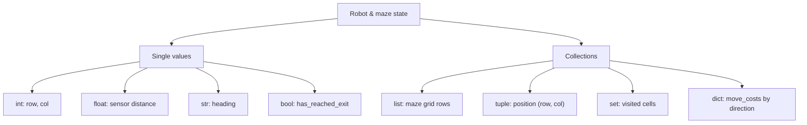

# Robotics Introduction for High Schoolers Part 2 — Unit 1: Python Essentials

This course builds toward a single capstone: writing a Python program that gets a TurtleBot out of a maze. Everything starts here, with how Python stores and represents the pieces of that problem — the robot's position, the maze layout, and the readings it collects along the way.

The map below shows which Python type this unit uses for each piece of robot and maze state.



## Variables and dynamic typing

Python names are labels bound to objects, not typed storage boxes. You never declare a type, and the same name can point at a completely different kind of value later in the program:

```python
robot_x = 0          # int: column in the maze grid
robot_y = 0           # int: row in the maze grid
heading = "north"     # str: which way the robot currently faces
has_reached_exit = False   # bool
```

This is convenient, but it also means Python won't stop you from writing `robot_x = "start"` by accident — it will only fail later, when some other line tries to do arithmetic on it. `type(robot_x)` and `isinstance(robot_x, int)` are your two go-to tools for checking what a variable actually holds when something looks off.

## Numbers, strings, and booleans

The maze problem needs three of Python's built-in types constantly: `int` for grid coordinates, `float` for anything measured (like a simulated distance sensor), and `str`/`bool` for state and flags. A few operators are worth calling out because they differ from C++:

```python
steps_taken = 17
cells_per_row = 5
row = steps_taken // cells_per_row     # floor division -> 3
col = steps_taken % cells_per_row      # modulo -> 2

wall_distance_m = 0.42
is_too_close = wall_distance_m < 0.5   # ordinary comparison, returns bool
in_bounds = 0 <= row < 5               # chained comparison — reads like math, no `and` needed
```

f-strings are the idiomatic way to build any message you print or log:

```python
print(f"robot at ({row}, {col}), facing {heading}, blocked={is_too_close}")
```

## Collections for maze state

A maze is naturally a grid, and a robot's plan is naturally a sequence — this is where `list`, `tuple`, `dict`, and `set` earn their keep:

```python
maze_row = ["wall", "open", "open", "wall", "exit"]      # list: ordered, mutable
position = (row, col)                                      # tuple: fixed pair, good as a dict key
visited = {(0, 0), (0, 1)}                                  # set: cells already explored, no duplicates
move_costs = {"north": 1, "south": 1, "east": 1, "west": 1}  # dict: name -> value lookup
```

Use a `list` for the maze grid itself (rows of cells, or a flat list of moves), a `tuple` for a coordinate pair you won't mutate, a `set` for "have I been here before?" checks (`in` on a set is fast), and a `dict` whenever you're looking something up by name rather than by position.

## Operating on the data

A few patterns you'll reuse throughout the rest of the course:

```python
path = [(0, 0), (0, 1), (1, 1), (2, 1)]

print(len(path))          # 4 — how many cells visited
print(path[-1])           # (2, 1) — the current (most recent) position
path.append((3, 1))        # record the next move

for r, c in path:          # unpacking tuples directly in a for-loop
    print(f"visited ({r}, {c})")
```

Indexing with `[-1]` for "the last one" and unpacking tuples straight into loop variables are both idioms you'll see constantly once you start writing the maze-solver.

## Try it yourself

Represent a 4x4 maze as a list of 4 lists, where each cell is the string `"open"`, `"wall"`, or `"exit"` (put `"exit"` in one corner). Write a few lines that store the robot's starting position as a tuple, then print whether the cell directly to the robot's right is `"wall"`, `"open"`, or out of bounds.
