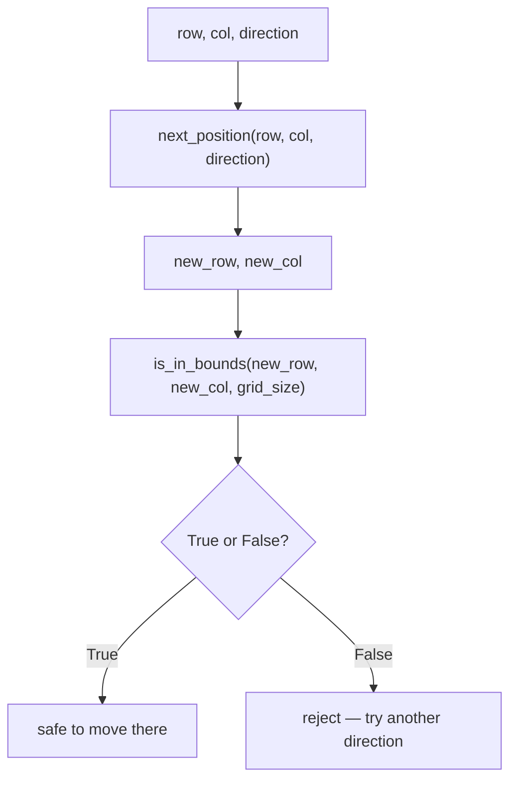

# Robotics Introduction for High Schoolers Part 2 — Unit 3: Methods

The maze-solver so far has been one long block of code. This unit breaks that logic into functions — Python's term for methods that aren't attached to an object yet — so each piece (sensing, deciding, moving) can be written, tested, and reused on its own.

The diagram below traces how data flows through the two functions from this unit's first example, from raw inputs to a movement decision.



## Defining and calling functions

`def` introduces a function; the return value comes back explicitly via `return` (a function with no `return` statement returns `None`):

```python
def is_in_bounds(row, col, grid_size):
    return 0 <= row < grid_size and 0 <= col < grid_size

def next_position(row, col, direction):
    moves = {"north": (-1, 0), "south": (1, 0), "east": (0, 1), "west": (0, -1)}
    dr, dc = moves[direction]
    return row + dr, col + dc

new_row, new_col = next_position(2, 3, "east")
print(is_in_bounds(new_row, new_col, grid_size=5))
```

Returning `row + dr, col + dc` returns a tuple — Python lets a function hand back multiple values this way without you having to define a struct or a class first.

## Default and keyword arguments

Parameters can have defaults, and callers can pass arguments by name instead of position — both make maze-navigation functions much more readable at the call site:

```python
def describe_move(direction, distance=1, verbose=False):
    if verbose:
        print(f"moving {direction} by {distance} cell(s)")
    return direction, distance

describe_move("north")                          # uses distance=1, verbose=False
describe_move("north", 2)                         # positional
describe_move(direction="north", verbose=True)     # keyword — order doesn't matter
```

Prefer keyword arguments once a function has more than two or three parameters, or whenever two parameters share a type (like two `int`s) and a mix-up would be easy to make silently.

## *args, **kwargs, and unpacking

Occasionally a function needs to accept a variable number of arguments — `*args` collects extra positional arguments into a tuple, `**kwargs` collects extra keyword arguments into a dict:

```python
def log_event(message, *tags, **details):
    print(message, tags, details)

log_event("wall detected", "sensor", "front", distance=0.2, step=14)
# -> wall detected ('sensor', 'front') {'distance': 0.2, 'step': 14}
```

You'll see this pattern often in libraries (including ROS 2 client libraries) where a function needs to forward arbitrary extra options without listing every one by name.

## Scope: local vs. global

Variables created inside a function are local to it and disappear when it returns; a function can read a variable from the enclosing scope but cannot modify it without saying `global`:

```python
steps_taken = 0

def take_step():
    global steps_taken
    steps_taken += 1     # without `global`, this would raise UnboundLocalError

take_step()
print(steps_taken)   # 1
```

In practice, relying on `global` is a code smell — prefer passing state in as an argument and getting the updated value back via `return`, which is exactly what Unit 4's classes will do more cleanly by storing state as attributes instead of loose globals.

## Try it yourself

Write a function `find_open_neighbors(grid, row, col)` that returns a list of `(row, col)` tuples for every neighboring cell (north/south/east/west) that is in bounds and not `"wall"`. Test it against the 4x4 maze from Unit 1 by calling it on the starting cell and printing the result.
