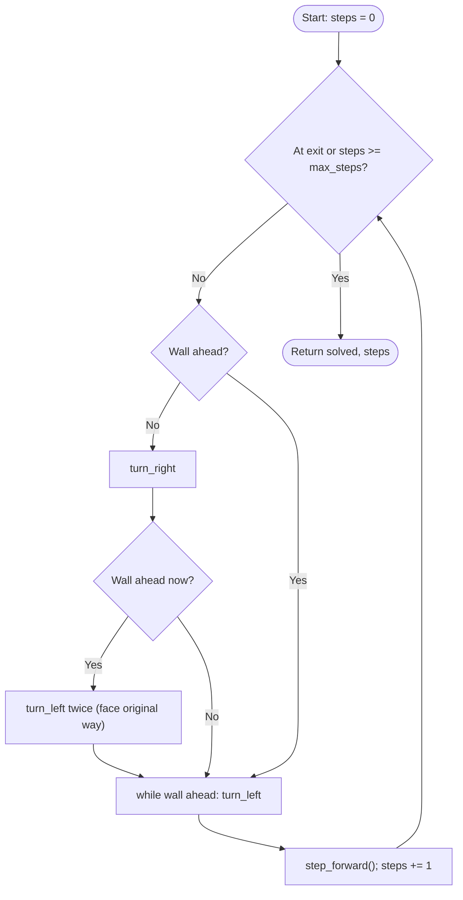

# Robotics Introduction for High Schoolers Part 2 — Unit 5: PROJECT — Help the TurtleBot Robot get out of the maze

This is the capstone: one program that combines variables, conditionals, loops, and the `TurtleBot` class from Units 1-4 to actually solve a maze, instead of solving small isolated exercises about each piece.

The flowchart below traces the right-hand-rule algorithm implemented in `solve()` below, one full iteration of its `while` loop.



## The maze

Represent the maze as a grid of strings, same as earlier units — `"open"` cells the robot can enter, `"wall"` cells it can't, and one `"exit"` cell that ends the run:

```python
maze = [
    ["open", "wall", "open", "open"],
    ["open", "open", "open", "wall"],
    ["wall", "wall", "open", "open"],
    ["open", "open", "open", "exit"],
]
```

The robot starts at `(0, 0)` facing east. The goal is to reach the `(3, 3)` cell without ever stepping onto a `"wall"` or off the edge of the grid.

## Reusing the TurtleBot class

Bring in the `TurtleBot` class from Unit 4 as-is — this is exactly why it was built as a class instead of loose variables. Add one method that reads the maze instead of guessing:

```python
class TurtleBot(Robot):
    def __init__(self, row, col, heading="east"):
        super().__init__(row, col, heading)
        self.bumped = False

    def sense_wall_ahead(self, maze):
        dr, dc = Robot.MOVES[self.heading]
        next_row, next_col = self.row + dr, self.col + dc
        out_of_bounds = not (0 <= next_row < len(maze) and 0 <= next_col < len(maze[0]))
        return out_of_bounds or maze[next_row][next_col] == "wall"
```

`sense_wall_ahead` is deliberately read-only — it answers a question without moving the robot, the same separation between "sensing" and "acting" that a real ROS 2 node keeps between a subscriber callback and a publisher call.

## The solving loop

A simple, honest strategy: try to turn toward the exit; if blocked, follow the wall on your right. This is the "right-hand rule" maze algorithm, and it's enough to solve any maze with no isolated islands:

```python
HEADINGS = ["north", "east", "south", "west"]   # clockwise order

def turn_right(bot):
    idx = HEADINGS.index(bot.heading)
    bot.turn(HEADINGS[(idx + 1) % 4])

def turn_left(bot):
    idx = HEADINGS.index(bot.heading)
    bot.turn(HEADINGS[(idx - 1) % 4])

def solve(maze, bot, max_steps=100):
    exit_row, exit_col = len(maze) - 1, len(maze[0]) - 1
    steps = 0

    while (bot.row, bot.col) != (exit_row, exit_col) and steps < max_steps:
        if not bot.sense_wall_ahead(maze):
            turn_right(bot)          # prefer hugging the right wall
            if bot.sense_wall_ahead(maze):
                turn_left(bot)        # right was blocked too, go straight instead
                turn_left(bot)
        while bot.sense_wall_ahead(maze):
            turn_left(bot)
        bot.step_forward()
        steps += 1

    return (bot.row, bot.col) == (exit_row, exit_col), steps
```

This isn't the cleanest possible maze-solving algorithm — it's written to make the control flow obvious: a `while` loop bounded by `max_steps` (Unit 2's lesson about never trusting an unbounded loop), calling methods on a `TurtleBot` object (Unit 4's lesson about bundling state and behavior), built from `if`/`elif` decisions at every turn (Unit 2 again).

## Running it

```python
bot = TurtleBot(0, 0)
solved, steps = solve(maze, bot)
print(f"{'Reached the exit' if solved else 'Gave up'} after {steps} steps, "
      f"final position {bot.position()}")
```

## Try it yourself

Add a `path` list to `TurtleBot.__init__`, append `self.position()` to it inside `step_forward()`, and print the full path after `solve()` finishes. Then edit the `maze` grid above to add a dead end and confirm the right-hand rule still finds the exit (or, for a bonus challenge, construct a maze where it doesn't — a loop with no wall connected to the outer boundary — and explain why it fails).
