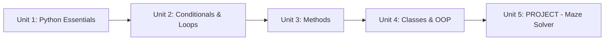

# Robotics Introduction for High Schoolers Part 2

The Python companion to Part 1's Linux basics: enough of the language to describe a robot's state, make decisions from sensor readings, and organize that logic into something reusable — building toward a single capstone project that solves a maze.

The diagram below shows how each unit's skills build directly on the last, ending in the maze-solving capstone.

1. [Python Essentials](01-python-essentials.md) — variables, types, and how a robot's position/readings live in them.
2. [Conditional Statements & Loops](02-conditional-statements-loops.md) — branching on sensor data and repeating actions until a goal is reached.
3. [Methods](03-methods.md) — breaking one long script into reusable, testable functions.
4. [Python Classes & OOP](04-python-classes-oop.md) — bundling a robot's state and behavior into a `Robot`/`TurtleBot` class.
5. [PROJECT: Help the TurtleBot Robot get out of the maze](05-project.md) — combining everything into one program that actually solves a maze.
