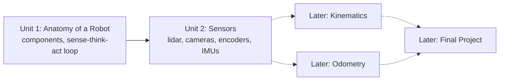

# Robotics Introduction For High Schoolers Part 3

This course explores robotics programming with Python alongside a simulated robot companion (Limo). It pulls apart what a robot is made of and how its parts coordinate, from lidars, encoders, and cameras feeding sensor data in through ROS messages, to actuators receiving motion commands out. Later units in this course (kinematics, odometry, and the final project) build directly on the anatomy and sensor concepts introduced in the two units below.

The diagram below shows how the two units in this course chain together, and how they in turn feed the kinematics, odometry, and final-project work referenced above.

1. [Anatomy of a Robot](01-anatomy-of-a-robot.md) — Components that make a robot
2. [Sensors](02-sensors.md) — Learn about the most common sensors found in robots
