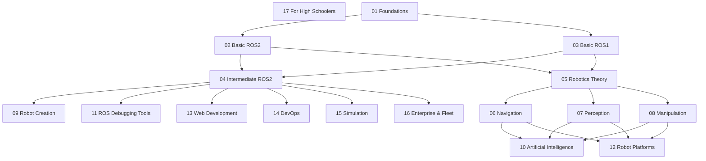

# robotcon

Robotics courses for myself to learn — a personal, numbered roadmap through robotics, from Linux/Python foundations up through AI, navigation, manipulation, and deployment.

## Structure

Each topic has two layers:

1. **Abstract** — the numbered `NNtopic.md` file at the repo root. A short course-catalog-style index for that topic: course titles, overviews, "what you'll learn" bullets, and a unit-by-unit outline. Read these first to see what a topic covers and decide what to dig into.
2. **Detailed content** — a `NNtopic/` subdirectory next to each abstract, one folder per course, one markdown file per unit/module inside it (e.g. `01foundations/linux-for-robotics/02-linux-essentials.md`). This is where the actual lessons live: explanations, examples, and hands-on material for that specific unit.

```
01foundations.md          <- abstract: Linux/Python/C++ course list
01foundations/
  linux-for-robotics/
    01-introduction.md
    02-linux-essentials.md
    ...
  python-3-for-robotics/
    ...
```

## Roadmap

| # | Topic |
|---|---|
| 01 | Foundations — Linux, Python & C++ for Robotics |
| 02 | Basic ROS 2 |
| 03 | Basic ROS (ROS 1) |
| 04 | Intermediate ROS 2 |
| 05 | Robotics Theory |
| 06 | Navigation |
| 07 | Perception |
| 08 | Manipulation |
| 09 | Robot Creation |
| 10 | Artificial Intelligence for Robotics |
| 11 | ROS Debugging Tools |
| 12 | Robot Platforms |
| 13 | Web Development for Robots |
| 14 | DevOps for Robotics |
| 15 | Simulation |
| 16 | Enterprise & Fleet Robotics |
| 17 | Robotics for High Schoolers |

## Learning Path

The diagram below shows how the 17 topics build on each other as prerequisites branch and recombine, rather than a single straight-line sequence.


